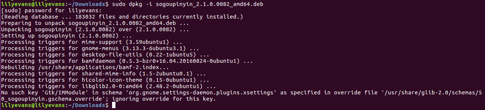

# Pinyin

## 添加fcitx键盘输入法系统

		sudo add-apt-repository ppa:fcitx-team/nightly
		sudo apt-get update
		sudo apt-get install fcitx
		sudo apt-get install fcitx-config-gtk
		sudo apt-get install fcitx-table-all
		sudo apt-get install im-switch

## 安装sogou输入法

		sudo dpkg -i sogoupinyin_2.1.0.0082_amd64.deb
最终会出现一些错误，但可以暂时不要去管这些错误:

## 设置语言选项:
* 到系统中设置->语言支持,将键盘输入法系统由默认的iBus更改为fcitx
* 在命令行输入reboot
* 搜索出fcitx配置，将sogou输入法设为默认的即可

