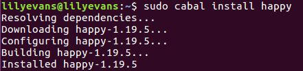
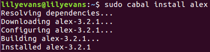
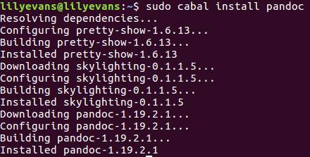

# pandoc installation #

## 安装方法 

```bash
sudo apt-get autoremove pandoc
sudo apt-get install cabal-install
proxychains cabal update
sudo cabal install pandoc
```

在运行`sudo cabal install pandoc`过程中，会遇到安装包依赖问题:

```bash
Resolving dependencies...
Downloading SHA-1.6.4.2...
Downloading cereal-0.5.4.0...
Downloading data-default-instances-containers-0.0.1...
Configuring cereal-0.5.4.0...
Building cereal-0.5.4.0...
Configuring data-default-instances-containers-0.0.1...
Downloading data-default-instances-dlist-0.0.1...
Building data-default-instances-containers-0.0.1...
Configuring data-default-instances-dlist-0.0.1...
Downloading data-default-instances-old-locale-0.0.1...
Building data-default-instances-dlist-0.0.1...
Installed data-default-instances-containers-0.0.1
Installed data-default-instances-dlist-0.0.1
Configuring data-default-instances-old-locale-0.0.1...
Downloading hxt-unicode-9.0.2.4...
Building data-default-instances-old-locale-0.0.1...
Installed data-default-instances-old-locale-0.0.1
Downloading memory-0.14.5...
Configuring hxt-unicode-9.0.2.4...
Building hxt-unicode-9.0.2.4...
Configuring memory-0.14.5...
Downloading network-2.6.3.2...
Building memory-0.14.5...
Installed hxt-unicode-9.0.2.4
Configuring network-2.6.3.2...
Downloading old-time-1.1.0.3...
Configuring old-time-1.1.0.3...
Downloading pem-0.2.2...
Installed cereal-0.5.4.0
Configuring pem-0.2.2...
Downloading pretty-show-1.6.13...
Building pem-0.2.2...
Installed pem-0.2.2
Installed memory-0.14.5
Building old-time-1.1.0.3...
Downloading primitive-0.6.2.0...
Configuring pretty-show-1.6.13...
Failed to install pretty-show-1.6.13
Build log ( /home/lilyevans/.cabal/logs/pretty-show-1.6.13.log ):
	Configuring pretty-show-1.6.13...
	setup-Simple-Cabal-1.22.5.0-x86_64-linux-ghc-7.10.3: The program 'happy' is
	required but it could not be found.
	Building network-2.6.3.2...
	Downloading random-1.1...
	Configuring primitive-0.6.2.0...
	Building primitive-0.6.2.0...
	Downloading regex-base-0.93.2...
	Configuring random-1.1...
	Building random-1.1...
	Downloading safe-0.3.14...
	Downloading stm-2.4.4.1...
	Installed old-time-1.1.0.3
	Configuring regex-base-0.93.2...
	Building regex-base-0.93.2...
	Configuring safe-0.3.14...
	Installed regex-base-0.93.2
	Building safe-0.3.14...
	Downloading syb-0.7...
	Installed random-1.1
	Configuring stm-2.4.4.1...
	Downloading text-1.2.2.2...
	Building stm-2.4.4.1...
	Installed primitive-0.6.2.0
	Configuring syb-0.7...
	Installed safe-0.3.14
	Building syb-0.7...
	Installed stm-2.4.4.1
	Downloading time-locale-compat-0.1.1.3...
	Configuring text-1.2.2.2...
	Installed network-2.6.3.2
	Building text-1.2.2.2...
	Downloading transformers-compat-0.5.1.4...
	Configuring time-locale-compat-0.1.1.3...
	Building time-locale-compat-0.1.1.3...
	Installed syb-0.7
	Configuring transformers-compat-0.5.1.4...
	Downloading unix-compat-0.4.3.1...
	Installed time-locale-compat-0.1.1.3
	Building transformers-compat-0.5.1.4...
	Configuring unix-compat-0.4.3.1...
	Downloading utf8-string-1.0.1.1...
	Building unix-compat-0.4.3.1...
	Downloading zlib-0.6.1.2...
	Configuring utf8-string-1.0.1.1...
	Installed transformers-compat-0.5.1.4
	Building utf8-string-1.0.1.1...
	Installed unix-compat-0.4.3.1
	Downloading data-default-0.7.1.1...
	Configuring zlib-0.6.1.2...
	Building zlib-0.6.1.2...
	Installed utf8-string-1.0.1.1
	Configuring data-default-0.7.1.1...
	Downloading asn1-types-0.3.2...
	Building data-default-0.7.1.1...
	Installed data-default-0.7.1.1
	Downloading cryptonite-0.23...
	Configuring asn1-types-0.3.2...
	Building asn1-types-0.3.2...
	Installed asn1-types-0.3.2
	Installed zlib-0.6.1.2
	Downloading regex-pcre-builtin-0.94.4.8.8.35...
	Configuring cryptonite-0.23...
	Building cryptonite-0.23...
	Downloading tf-random-0.5...
	Configuring regex-pcre-builtin-0.94.4.8.8.35...
	Downloading async-2.1.1.1...
	Configuring SHA-1.6.4.2...
	Building regex-pcre-builtin-0.94.4.8.8.35...
	Building SHA-1.6.4.2...
	Downloading socks-0.5.5...
	Downloading exceptions-0.8.3...
	Downloading mmorph-1.1.0...
	Downloading tagged-0.8.5...
	Downloading transformers-base-0.4.4...
	Downloading filemanip-0.3.6.3...
	Downloading asn1-encoding-0.9.5...
	Installed text-1.2.2.2
	Downloading blaze-builder-0.4.0.2...
	Downloading cmark-0.5.5.1...
	Configuring tf-random-0.5...
	Configuring async-2.1.1.1...
	Installed regex-pcre-builtin-0.94.4.8.8.35
	Building async-2.1.1.1...
	Building tf-random-0.5...
	Downloading hashable-1.2.6.0...
	Downloading mime-types-0.1.0.7...
	Configuring exceptions-0.8.3...
	Installed async-2.1.1.1
	Downloading parsec-3.1.11...
	Building exceptions-0.8.3...
	Downloading tagsoup-0.14.1...
	Downloading xml-1.3.14...
	Configuring socks-0.5.5...
	Installed tf-random-0.5
	Downloading zip-archive-0.3.0.6...
	Building socks-0.5.5...
	Configuring tagged-0.8.5...
	Installed exceptions-0.8.3
	Downloading temporary-1.2.0.4...
	Building tagged-0.8.5...
	Configuring mmorph-1.1.0...
	Installed tagged-0.8.5
	Building mmorph-1.1.0...
	Configuring transformers-base-0.4.4...
	Installed mmorph-1.1.0
	Building transformers-base-0.4.4...
	Configuring filemanip-0.3.6.3...
	Installed transformers-base-0.4.4
	Downloading monad-control-1.0.1.0...
	Configuring asn1-encoding-0.9.5...
	Installed socks-0.5.5
	Building filemanip-0.3.6.3...
	Building asn1-encoding-0.9.5...
	Installed filemanip-0.3.6.3
	Configuring blaze-builder-0.4.0.2...
	Building blaze-builder-0.4.0.2...
	Configuring hashable-1.2.6.0...
	Installed asn1-encoding-0.9.5
	Downloading asn1-parse-0.9.4...
	Building hashable-1.2.6.0...
	Configuring mime-types-0.1.0.7...
	Installed cryptonite-0.23
	Building mime-types-0.1.0.7...
	Configuring cmark-0.5.5.1...
	Installed blaze-builder-0.4.0.2
	Downloading blaze-markup-0.8.0.0...
	Downloading cookie-0.4.2.1...
	Configuring tagsoup-0.14.1...
	Installed hashable-1.2.6.0
	Building cmark-0.5.5.1...
	Downloading streaming-commons-0.1.18...
	Building tagsoup-0.14.1...
	Downloading unordered-containers-0.2.8.0...
	Downloading uuid-types-1.0.3...
	Configuring parsec-3.1.11...
	Installed mime-types-0.1.0.7
	Building parsec-3.1.11...
	Configuring xml-1.3.14...
	Installed tagsoup-0.14.1
	Building xml-1.3.14...
	Configuring zip-archive-0.3.0.6...
	Installed parsec-3.1.11
	Downloading hxt-regex-xmlschema-9.2.0.3...
	Downloading network-uri-2.6.1.0...
	Configuring temporary-1.2.0.4...
	Installed cmark-0.5.5.1
	Building temporary-1.2.0.4...
	Configuring monad-control-1.0.1.0...
	Installed xml-1.3.14
	Building monad-control-1.0.1.0...
	Installed temporary-1.2.0.4
	Configuring asn1-parse-0.9.4...
	Building asn1-parse-0.9.4...
	Configuring cookie-0.4.2.1...
	Installed monad-control-1.0.1.0
	Downloading lifted-base-0.2.3.11...
	Building cookie-0.4.2.1...
	Configuring streaming-commons-0.1.18...
	Installed asn1-parse-0.9.4
	Downloading x509-1.6.5...
	Building streaming-commons-0.1.18...
	Configuring blaze-markup-0.8.0.0...
	Installed cookie-0.4.2.1
	Building blaze-markup-0.8.0.0...
	Configuring unordered-containers-0.2.8.0...
	Installed blaze-markup-0.8.0.0
	Downloading blaze-html-0.9.0.1...
	Building unordered-containers-0.2.8.0...
	Configuring uuid-types-1.0.3...
	Installed streaming-commons-0.1.18
	Building uuid-types-1.0.3...
	Configuring hxt-regex-xmlschema-9.2.0.3...
	Installed uuid-types-1.0.3
	Building hxt-regex-xmlschema-9.2.0.3...
	Configuring network-uri-2.6.1.0...
	Installed SHA-1.6.4.2
	Building network-uri-2.6.1.0...
	Installed unordered-containers-0.2.8.0
	Downloading semigroups-0.18.3...
	Configuring lifted-base-0.2.3.11...
	Configuring x509-1.6.5...
	Installed hxt-regex-xmlschema-9.2.0.3
	Building lifted-base-0.2.3.11...
	Building x509-1.6.5...
	Configuring blaze-html-0.9.0.1...
	Installed network-uri-2.6.1.0
	Downloading HTTP-4000.3.7...
	Downloading hxt-9.3.1.16...
	Building blaze-html-0.9.0.1...
	Configuring semigroups-0.18.3...
	Installed lifted-base-0.2.3.11
	Building semigroups-0.18.3...
	Downloading resourcet-1.1.9...
	Building zip-archive-0.3.0.6...
	Installed x509-1.6.5
	Downloading x509-store-1.6.2...
	Configuring HTTP-4000.3.7...
	Building HTTP-4000.3.7...
	Configuring resourcet-1.1.9...
	Installed zip-archive-0.3.0.6
	Building resourcet-1.1.9...
	Configuring hxt-9.3.1.16...
	Installed semigroups-0.18.3
	Downloading QuickCheck-2.9.2...
	Downloading case-insensitive-1.2.0.10...
	Building hxt-9.3.1.16...
	Downloading vector-0.12.0.1...
	Installed resourcet-1.1.9
	Downloading conduit-1.2.10...
	Configuring x509-store-1.6.2...
	Building x509-store-1.6.2...
	Configuring QuickCheck-2.9.2...
	Installed x509-store-1.6.2
	Downloading x509-system-1.6.4...
	Downloading x509-validation-1.6.5...
	Building QuickCheck-2.9.2...
	Configuring case-insensitive-1.2.0.10...
	Installed HTTP-4000.3.7
	Building case-insensitive-1.2.0.10...
	Installed case-insensitive-1.2.0.10
	Downloading http-types-0.9.1...
	Configuring vector-0.12.0.1...
	Building vector-0.12.0.1...
	Configuring conduit-1.2.10...
	Installed QuickCheck-2.9.2
	Building conduit-1.2.10...
	Configuring x509-system-1.6.4...
	Installed blaze-html-0.9.0.1
	Building x509-system-1.6.4...
	Configuring x509-validation-1.6.5...
	Installed x509-system-1.6.4
	Building x509-validation-1.6.5...
	Installed conduit-1.2.10
	Configuring http-types-0.9.1...
	Building http-types-0.9.1...
	Installed x509-validation-1.6.5
	Downloading tls-1.3.10...
	Configuring tls-1.3.10...
	Installed http-types-0.9.1
	Downloading http-client-0.5.7.0...
	Building tls-1.3.10...
	Configuring http-client-0.5.7.0...
	Building http-client-0.5.7.0...
	Installed http-client-0.5.7.0
	Installed tls-1.3.10
	Downloading connection-0.2.8...
	Configuring connection-0.2.8...
	Installed hxt-9.3.1.16
	Building connection-0.2.8...
	Installed connection-0.2.8
	Downloading http-client-tls-0.3.5...
	Installed vector-0.12.0.1
	Downloading JuicyPixels-3.2.8.1...
	Downloading scientific-0.3.4.13...
	Configuring http-client-tls-0.3.5...
	Building http-client-tls-0.3.5...
	Installed http-client-tls-0.3.5
	Configuring scientific-0.3.4.13...
	Building scientific-0.3.4.13...
	Installed scientific-0.3.4.13
	Downloading attoparsec-0.13.1.0...
	Configuring attoparsec-0.13.1.0...
	Building attoparsec-0.13.1.0...
	Installed attoparsec-0.13.1.0
	Downloading aeson-1.2.0.0...
	Configuring aeson-1.2.0.0...
	Building aeson-1.2.0.0...
	Configuring JuicyPixels-3.2.8.1...
	Building JuicyPixels-3.2.8.1...
	Installed aeson-1.2.0.0
	Downloading doctemplates-0.1.0.2...
	Downloading pandoc-types-1.17.0.5...
	Downloading yaml-0.8.23...
	Configuring doctemplates-0.1.0.2...
	Building doctemplates-0.1.0.2...
	Configuring pandoc-types-1.17.0.5...
	Building pandoc-types-1.17.0.5...
	Configuring yaml-0.8.23...
	Building yaml-0.8.23...
	Installed doctemplates-0.1.0.2
	Installed JuicyPixels-3.2.8.1
	Installed pandoc-types-1.17.0.5
	Downloading texmath-0.9.4...
	Installed yaml-0.8.23
	Configuring texmath-0.9.4...
	Building texmath-0.9.4...
	Installed texmath-0.9.4
	cabal: Error: some packages failed to install:
	pandoc-1.19.2.1 depends on pretty-show-1.6.13 which failed to install.
	pretty-show-1.6.13 failed during the configure step. The exception was:
	ExitFailure 1
	skylighting-0.1.1.5 depends on pretty-show-1.6.13 which failed to install.

```

依赖安装包happy和alex:

```bash
sudo cabal install happy
sudo cabal install alex
```



接着继续运行:

```bash
sudo cabal install pandoc
```


## 设置环境变量

在.bashrc文件中添加

```bash
export PATH=/home/lilyevans/.cabal/bin:$PATH
```

运行:

```bash
sudo pluma /etc/profile
```

在profile文件最后添加:

```bash
export PATH=/home/lilyevans/.cabal/bin:$PATH
```

在/etc文件夹下执行:
```bash
source profile
export
```
若在export出的信息中，发现添加的路径在PATH环境变量中，那么就成功了。

添加完PATH后，再:
```bash
pandoc --version
```
若希望继续安装与之相关的依赖，可以:
```bash
cabal install pandoc-citeproc
cabal install pandoc-crossref
```
