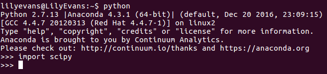
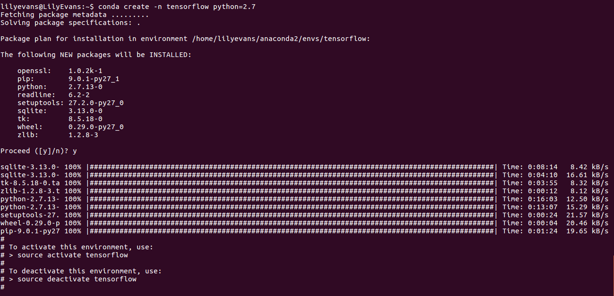
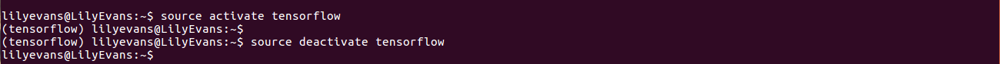
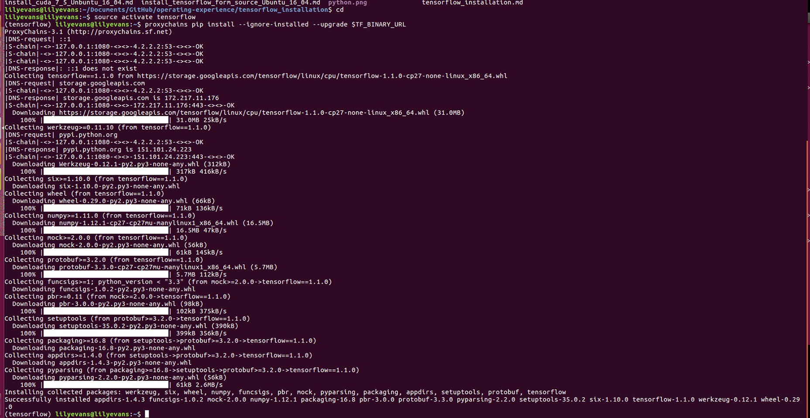
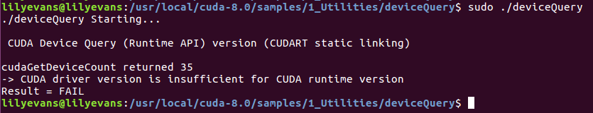
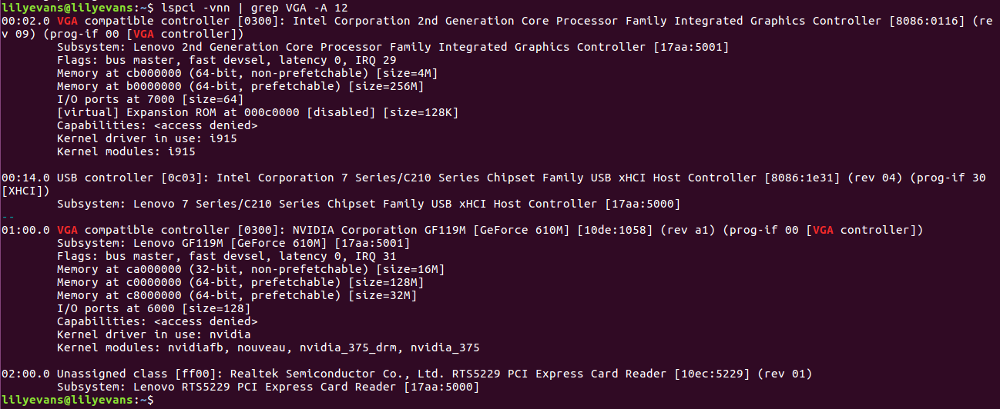
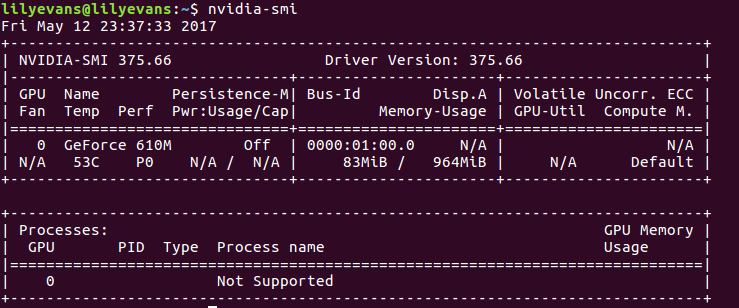
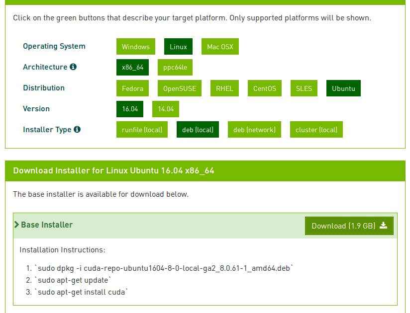
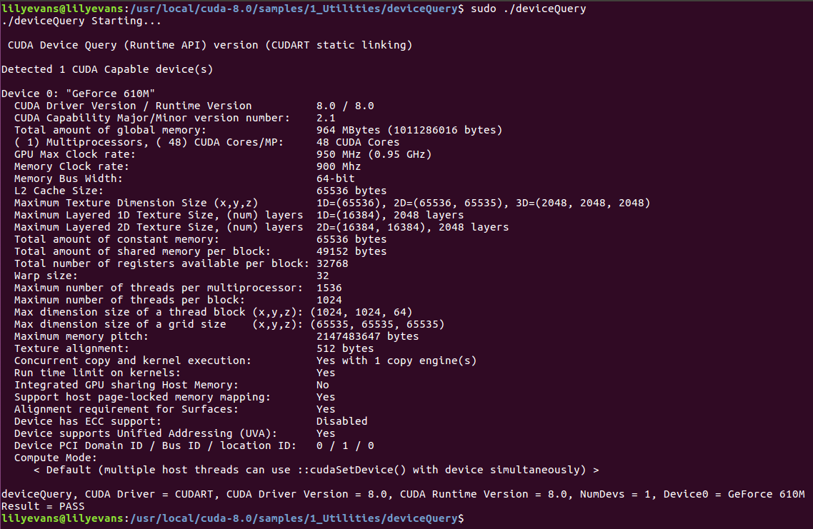

# Tensorflow Installation

## 1. install Anaconda2-4.3.1-Linux-x86_64.sh

* 参考 [Tensorflow学习笔记(一补):使用Anaconda安装Tensorflow](blog.csdn.net/nxcxl88/article/details/52704877?locationNum=13)的安装方法

* 由于在官网上下载速度太慢，因此，实际操作中是通过以下命令获取的Anaconda:
 > wget https://mirrors.tuna.tsinghua.edu.cn/anaconda/archive/Anaconda2-4.3.1-Linux-x86_64.sh

* 下载完毕，通过以下命令进行Anaconda安装：
> bash Anaconda2-4.3.1-Linux-x86_64.sh

* 测试Anaconda是否安装成功:

## 2. 建立名叫tensorflow的计算环境

> ###### Python 2.7
> $ conda create -n tensorflow python=2.7
> ###### Python 3.4
> $ conda create -n tensorflow python=3.4

具体运行结果如下:

## 3. 激活以及关闭tensorflow的环境

> ###### To activate this environment, use:
> $ source activate tensorflow
> ###### To deactivate this environment, use:
> $ source deactivate tensorflow

具体运行结果如下:

## 4. pip方式

* pip方式首先要激活conda环境
> $ source activate tensorflow

* 然后根据要安装的不同tensorflow版本选择对应的一条环境变量设置export语句(操作系统，Python版本，CPU版本还是CPU+GPU版本)
> ###### Ubuntu/Linux 64-bit, CPU only, Python 2.7
> (tensorflow) $ export TF_BINARY_URL=https://storage.googleapis.com/tensorflow/linux/cpu/tensorflow-1.1.0-cp27-none-linux_x86_64.whl
> ###### Ubuntu/Linux 64-bit, GPU enabled, Python 2.7
> ###### Requires CUDA toolkit 7.5 and CuDNN v5. For other versions, see "Install from sources" below.
> (tensorflow) $ export TF_BINARY_URL=https://storage.googleapis.com/tensorflow/linux/gpu/tensorflow_gpu-1.1.0-cp27-none-linux_x86_64.whl

* 接着通过以下命令进行安装:(注意，由于要登录tensorflow官网要翻墙，因此需要在以下命令之前添加proxychains)
> (tensorflow) $ pip install --ignore-installed --upgrade $TF_BINARY_URL

具体运行结果如下:

## 5. 英伟达驱动、CUDA、cuDNN的安装

参考 [Win10 Tensorflow(gpu)安装详解](blog.csdn.net/sb19931201/article/details/53648615) 进行安装操作 

参考 [安装英伟达显卡驱动](www.cnblogs.com/xujianqing/p/6142963.html) 进行安装操作 

### a. 首先要激活anaconda2环境
> $ source activate anaconda2
> (anaconda2) $ sudo pip install tensorflow-gpu
> $ source deactivate anaconda2

### b. 卸载原有的CUDA driver(否则在后续安装过程中会出现一下错误)
> $ `sudo apt-get purge nvidia*`

### c. 先去英伟达官网上查看适合你的GPU驱动
> $ sudo add-apt-repository ppa:graphics-drivers/ppa
> $ sudo apt-get update
> $ sudo apt-get install nvidia-375(375是你查到的版本号)
	一般而言可以通过在命令行输入:
	> $ lspci -vnn | grep VGA -A 12 

> $ sudo apt-get install mesa-common-dev
> $ sudo apt-get install freeglut3-dev
执行完上述后，重启
> $ reboot
重启后输入
> $ nvidia-smi
如果出现了你的GPU列表，则说明驱动安装成功了。
另外也可以通过，或者输入
> $ nvidia-settings
出现

### d. 接着要安装cuda

> $ sudo dpkg -i cuda-repo-ubuntu1604-8-0-local-ga2_8.0.61-1_amb64.deb
> $ sudo apt-get update
> $ sudo apt-get install cuda

> $ sudo apt-get install gcc-4.9 gcc-5 g++-4.9 g++-5
> $ sudo update-alternatives --install /usr/bin/gcc gcc /usr/bin/gcc-4.9 20
> $ sudo update-alternatives --install /usr/bin/gcc gcc /usr/bin/gcc-5 10
> $ sudo update-alternatives --install /usr/bin/g++ g++ /usr/bin/g++-4.9 20
> $ sudo update-alternatives --install /usr/bin/g++ g++ /usr/bin/g++-5 10
> $ sudo update-alternatives --install /usr/bin/cc cc /usr/bin/gcc 30
> $ sudo update-alternatives --set cc /usr/bin/gcc
> $ sudo update-alternatives --install /usr/bin/c++ c++ /usr/bin/g++ 30
> $ sudo update-alternatives --set c++ /usr/bin/g++

接着在.bashrc文件后面加上:
export PATH=/usr/local/cuda-8.0/bin${PATH:+:${PATH}}
export LD_LIBRARY_PATH=/usr/local/cuda8.0/lib64${LD_LIBRARY_PATH:+:${LD_LIBRARY_PATH}}
然后设置环境变量和动态链接库，在命令行输入:
sudo gedit /etc/profile
在打开的文件里面加上:
export PATH=/usr/local/cuda/bin:$PATH
保存之后，创建链接文件:
sudo gedit /etc/ld.so.conf.d/cuda.conf
在打开的文件中添加如下语句:
/usr/local/cuda/lib64
保存退出执行命令行:
sudo ldconfig
使链接立即生效。

### 测试cuda的Samples
在命令行输入:
> $ cd /usr/local/cuda-8.0/samples/1_Utilities/deviceQuery
> $ sudo make
> $ sudo ./deviceQuery

### 安装cuDNN
下载 [cuDNN](https://developer.nvidia.com/cudnn)注意，要下载5.0版本
> $ tar zxvf cudnn-8.0-linux-x64-v5.0.tgz
> 接着进入cuda目录:
> $ sudo cp include/cudnn.h ~/usr/local/cuda/include/
> $ `sudo cp lib64/libcudnn* ~/usr/local/cuda/lib64/`
> $ cd /usr/local/cuda/lib64/
> $ sudo rm -rf libcudnn.so libcudnn.so.5
> $ sudo ln -s libcudnn.so.5.0.5 libcudnn.so.5
> $ sudo ln -s libcudnn.so.5 libcudnn.so

## 测试安装结果
> $ conda install ipython
> $ source deactivate tensorflow
> $ source activate tensorflow
> (tensorflow) $ python
> > import tensorflow as tf
> > import numpy as np
> > x_data = np.random.rand(100).astype(np.float32)
> > y_data = x_data * 0.1 + 0.3
> > W = tf.Variable(tf.random_uniform([1], -1.0, 1.0))
> > b = tf.Variable(tf.zeros([1]))
> > y = W * x_data + b
> > loss = tf.reduce_mean(tf.square(y - y_data))
> > optimizer = tf.train.GradientDescentOptimizer(0.5)
> > train = optimizer.minimize(loss)
> > init = tf.initialize_all_variables()
> > sess = tf.Session()
> > sess.run(init)
> > for step in range(201):
> ...  sess.run(train)
> ...  if step % 20 == 0:
> ...    print(step, sess.run(W), sess.run(b))
> 最终的输出结果W:[0.1], b:[0.3]

