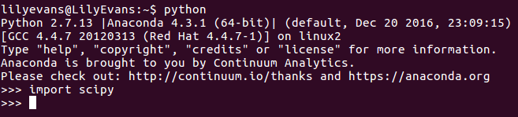
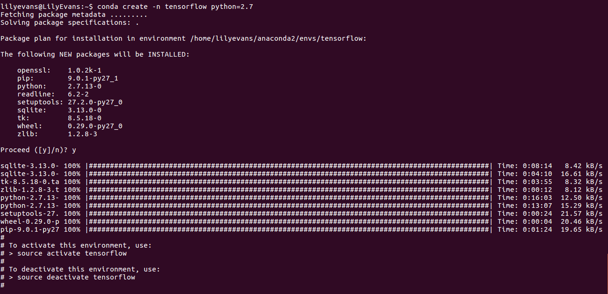
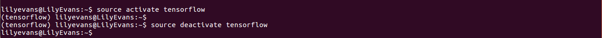
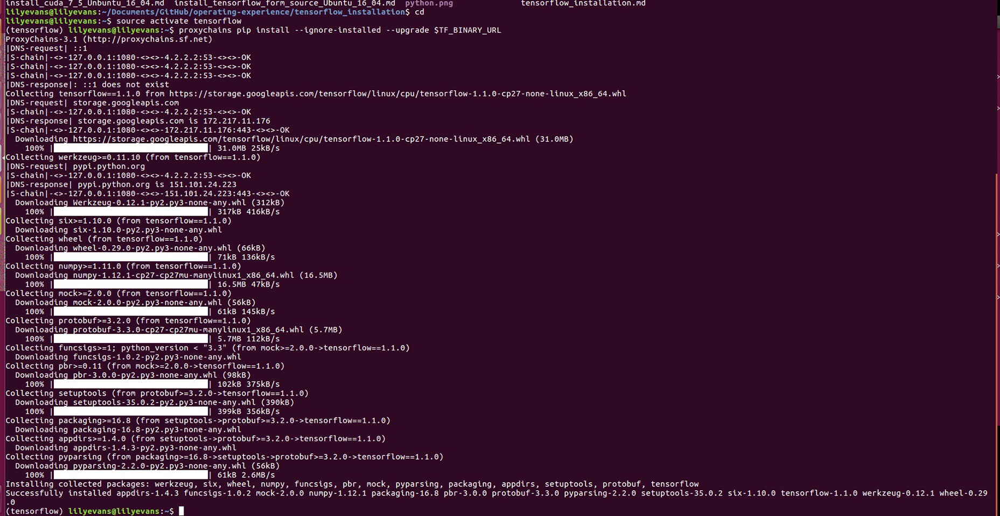

# Tensorflow Installation

## 1. install Anaconda2-4.3.1-Linux-x86_64.sh

* 由于在官网上下载速度太慢，因此，实际操作中是通过以下命令获取的Anaconda:
 > **wget https://mirrors.tuna.tsinghua.edu.cn/anaconda/archive/Anaconda2-4.3.1-Linux-x86_64.sh**
* 下载完毕，通过以下命令进行Anaconda安装：
> **bash Anaconda2-4.3.1-Linux-x86_64.sh**
* 测试Anaconda是否安装成功:

## 2. 建立名叫tensorflow的计算环境

> ###### Python 2.7
> $ conda create -n tensorflow python=2.7
> ###### Python 3.4
> $ conda create -n tensorflow python=3.4

具体运行结果如下:

## 3. 激活以及关闭tensorflow的环境

> ###### To activate this environment, use:
> $ source activate tensorflow
> ###### To deactivate this environment, use:
> $ source deactivate tensorflow

具体运行结果如下:

## 4. pip方式

* pip方式首先要激活conda环境
> $ source activate tensorflow

* 然后根据要安装的不同tensorflow版本选择对应的一条环境变量设置export语句(操作系统，Python版本，CPU版本还是CPU+GPU版本)
> ## Ubuntu/Linux 64-bit, CPU only, Python 2.7
> (tensorflow)$ export TF_BINARY_URL=https://storage.googleapis.com/tensorflow/linux/cpu/tensorflow-1.1.0-cp27-none-linux_x86_64.whl
> ## Ubuntu/Linux 64-bit, GPU enabled, Python 2.7
> ### Requires CUDA toolkit 7.5 and CuDNN v5. For other versions, see "Install from sources" below.
> (tensorflow)$ export TF_BINARY_URL=https://storage.googleapis.com/tensorflow/linux/gpu/tensorflow-1.1.0-cp27-none-linux_x86_64.whl

* 接着通过以下命令进行安装:(注意，由于要登录tensorflow官网要翻墙，因此需要在以下命令之前添加proxychains)
> (tensorflow)$ pip install --ignore-installed --upgrade $TF_BINARY_URL

具体运行结果如下:

## 5. tensorflow-gpu的安装

* 首先要激活anaconda2环境
> $ source activate anaconda2
> (anaconda2) $ sudo pip install tensorflow-gpu
> $ source deactivate anaconda2

* 接着要安装cuda
[download cuda](download_cuda.png)
